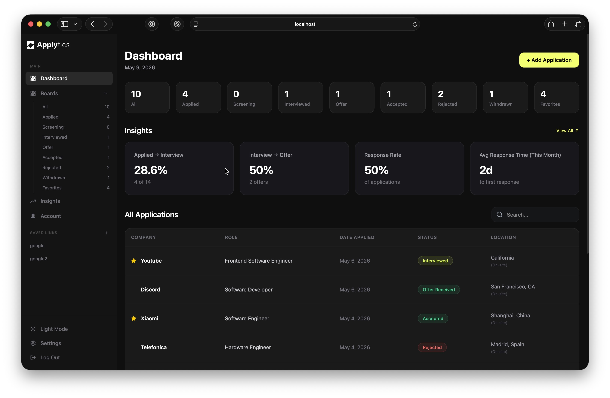
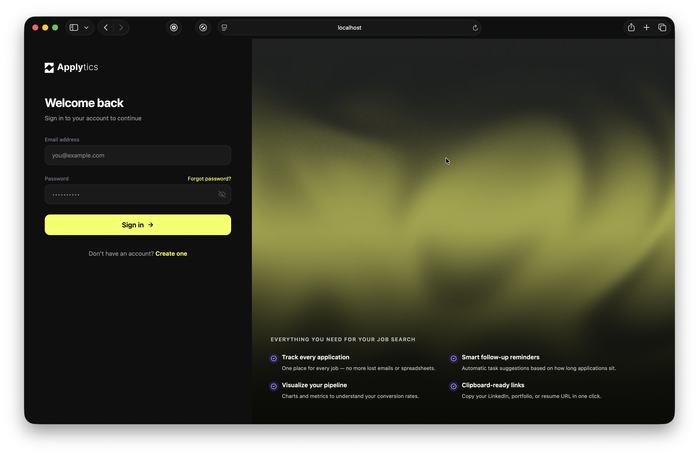
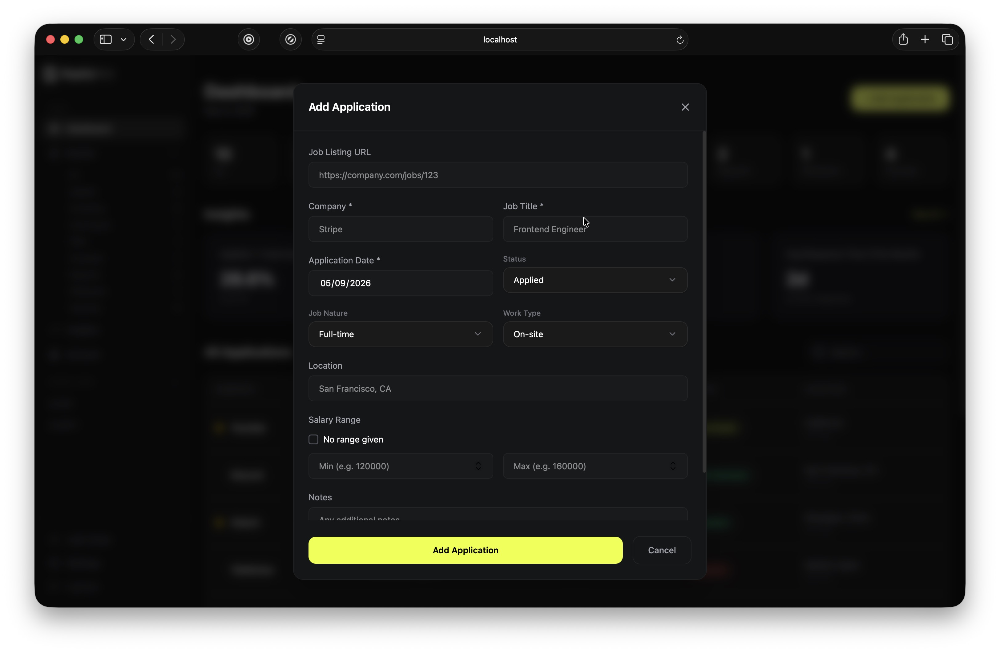
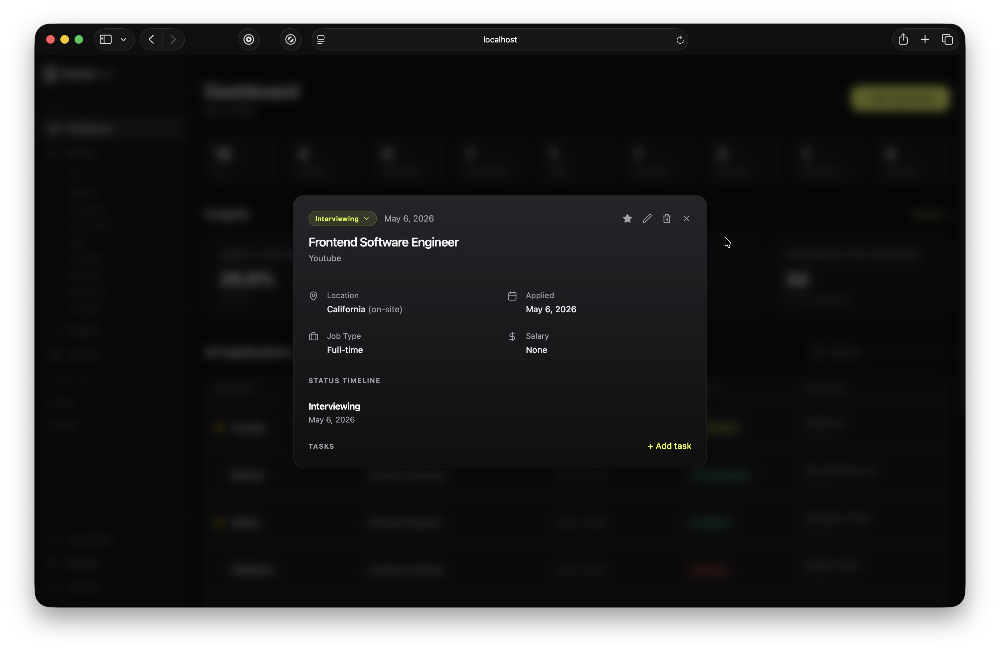
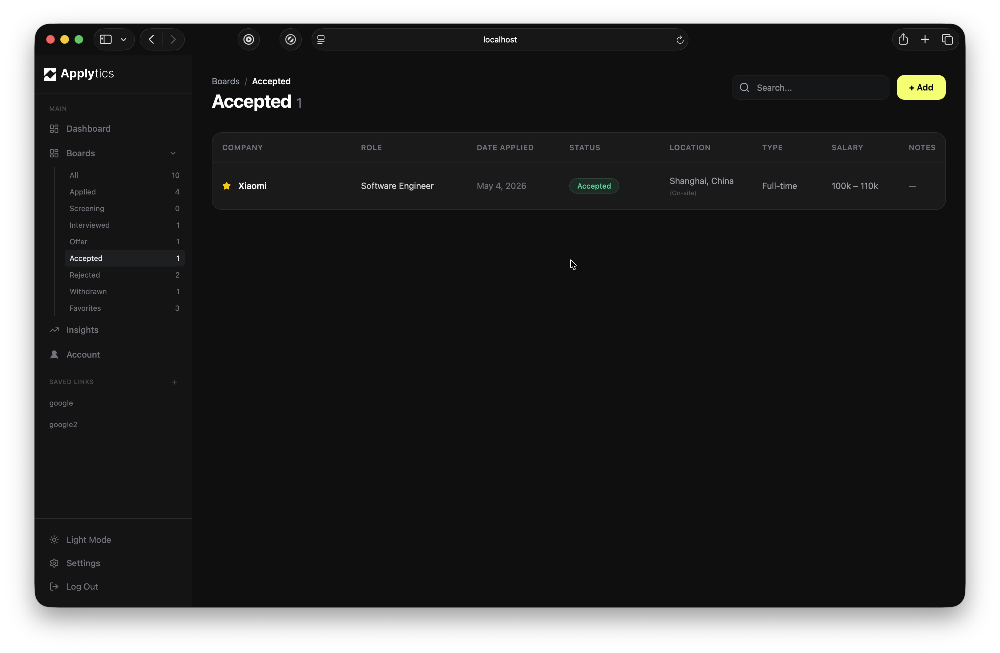
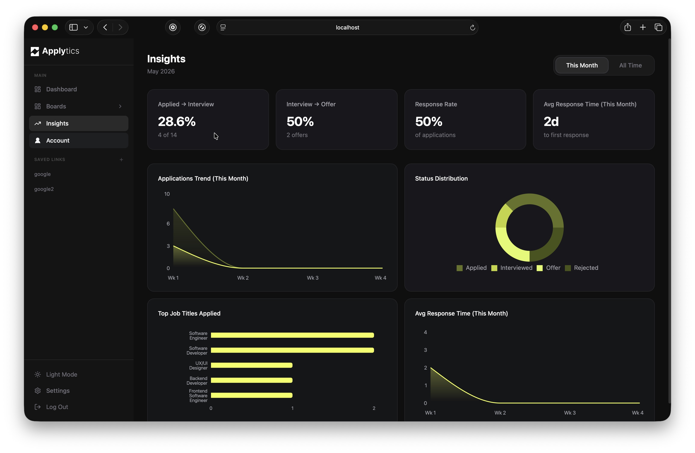
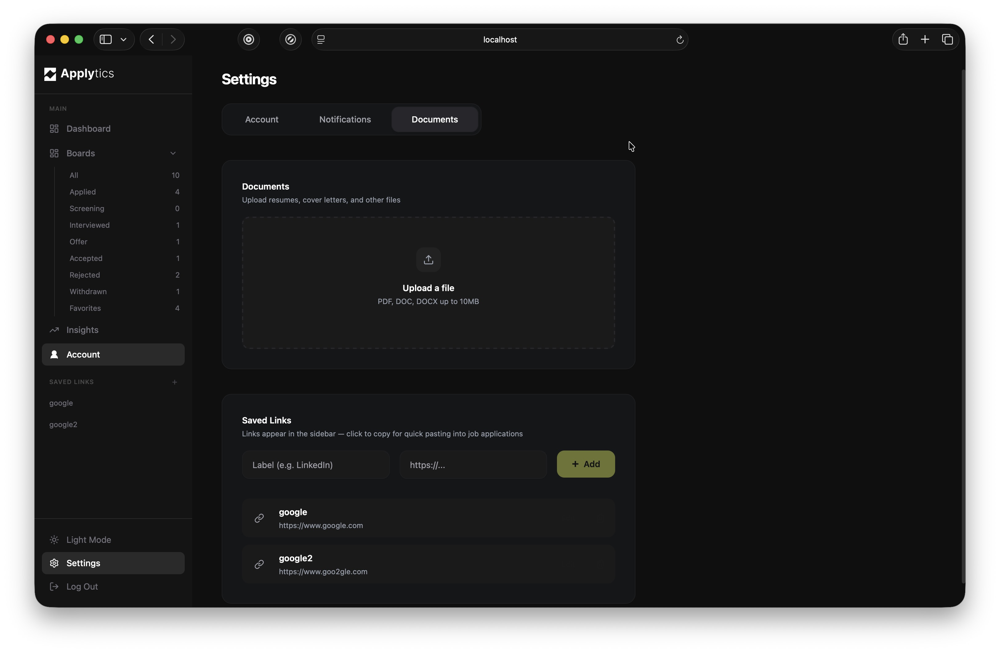

#  
### Applytics keeps your entire job search organized in one place.

Applytics is a full-stack job application tracking platform that helps users organize, monitor, and optimize their job search in one place.

Project specifications: https://github.com/chingu-voyages/voyage-project-job-tracker

## Features
- [Authentication](#authentication)
- [CRUD functionality](#crud-functionality)
- [Application Overview (with quick status change)](#application-overview-with-quick-status-change)
- [Board View with Filtered Applications](#board-view-with-filtered-applications)
- [Insights Dashboard & Analytics](#insights-dashboard--analytics)
- [Profile & Settings Management](#profile--settings-management)
- [Add Links](#add-links)
- [Favorite Applications](#favorite-applications)
- [Sort Applications](#sort-applications)
- [Light/Dark Mode](#lightdark-mode)

### Authentication
Secure user authentication system with protected routes, persistent sessions, and personalized job tracking data.  Users can sign-up, login, and change password via an e-mailed link.

### CRUD Functionality
Create, edit, update, and delete job applications with a user-friendly interface.

### Application Overview (with quick status change)
View detailed application information in modal form with the ability to quickly update application status via drop-down menu.

### Board View with Filtered Applications
Quickly view applicatons by sorting them by status.

### Insights Dashboard & Analytics
Track job search progress with conversion metrics, analytics, and visualized application data.

### Profile & Settings Management
Manage account preferences, user information and settings, and personalized document storage. 

### Add Links
Pin relevant links such as job postings, company websites, portfolios, and application resources

### Favorite Applications
Mark important job applications as favorites for quick access and prioritization.

### Light/Dark Mode
Toggle between light and dark themes for a customizable user experience.

## Tech Stack & Dependencies

### Frontend
- React
- TypeScript
- Tailwind CSS
- Vite
- React Router (Routing)
- React Hook Form & Zod (Forms & Validation)
- Axios (API calls)
- Recharts (Data Visualization)
- Lucide React (Icons)

### Backend
- Laravel (PHP)
- MySQL

## API Endpoints
All API endpoints can be found at: https://jobtracker-api.afuwapetunde.com/docs.
This comprehensive page details all API functionality in full and includes implementation code.  

## Deployment
- Frontend on Vercel: https://v60-tier3-team-33.vercel.app/
- Backend on Railway: https://jobtracker-api.afuwapetunde.com/api

### Deploy on local machine
1. Clone the repo `git clone https://github.com/chingu-voyages/V60-tier3-team-33.git`
2. Frontend
    - Install dependences from the root directory: `cd frontend && npm install`
    - run `npm run dev`
    - open `http://localhost:5173`

## Our Team

Applytics was developed by Team Async Alliance:

- Zuwee Ali (Scrum Master): [GitHub](https://github.com/zuweeali) / [LinkedIn](https://linkedin.com/in/zuwaira-aliyu-mohammed)
- Afuwape Babatunde (Developer): [GitHub](https://github.com/Afubasic) / [LinkedIn](https://www.linkedin.com/in/afuwape-babatunde/)
- Ivan Brovko (Developer): [GitHub](https://github.com/HoneyVanya) / [LinkedIn](https://linkedin.com/in/ivan-brovko)
- Greg Minezzi (Developer): [GitHub](https://github.com/minezzig) / [LinkedIn](https://linkedin.com/in/gregminezzi)
- Olivia Prusinowski (UX/UI Designer): [GitHub](https://github.com/opruz) / [LinkedIn](http://www.linkedin.com/in/olivia-prusinowski-040268160)
- Anthony Tibamwenda (Developer): [GitHub](https://github.com/AskTiba) / [LinkedIn](https://www.linkedin.com/in/tibamwenda-anthony-64144820b/)