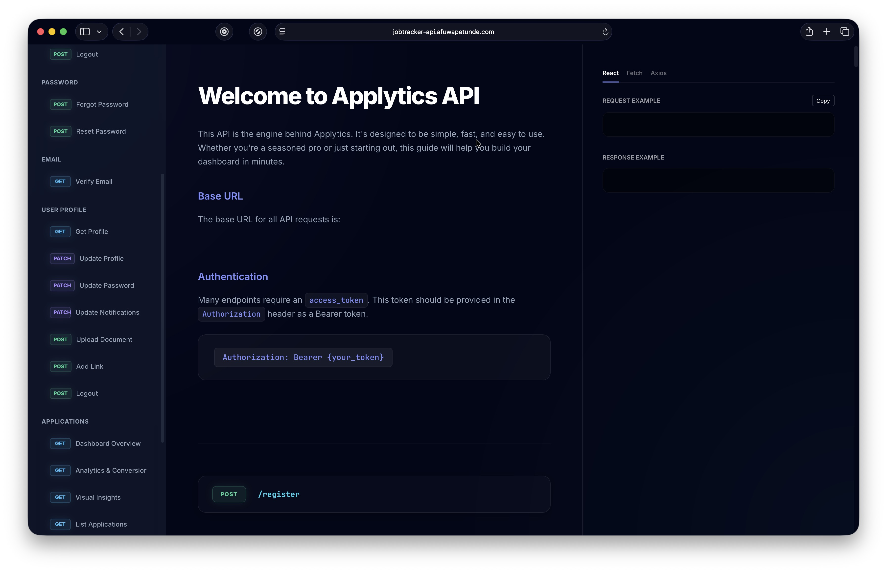

# 

A full-stack job application tracking platform that helps users organize, monitor, and optimize their job search.

Project specifications: https://github.com/chingu-voyages/voyage-project-job-tracker

## Features
- authentication
- full CRUD
- favorites
- sorting
- quick status change
- filter by status
- view conversion rates an analytics
- light/dark mode
- add links
- view profile/settings options

### Future goals
- add functionality to settings
- edit user profile
- implement notifications

## Tech Stack & Dependences

### Frontend
- React
- TypeScript
- Tailwind CSS
- Vite
- React Router (Routing)
- React Hook Form & Zod (Forms & Validation)
- Axios (API calls)
- Recharts (Data Visualization)
- Lucide React (Icons)

### Backend
- Laravel (PHP)
- MySQL

## API Endpoints
All API endpoints can be found at: https://jobtracker-api.afuwapetunde.com/docs.
This comprehensive page details all API functionality in full and includes implmentation code.  

## Deployment
- Frontend on Vercel: https://v60-tier3-team-33.vercel.app/
- Backend on Railway: https://jobtracker-api.afuwapetunde.com/api

### Deploy on local machine
1. Clone the repo `git clone https://github.com/chingu-voyages/V60-tier3-team-33.git`
2. Frontend
    - Install dependences from the root directory: `cd frontend && npm install`
    - run `npm run dev`
    - open `http://localhost:5173`

## Our Team

Applytics was developed by Team Async Alliance:

- Zuzu (Scrum Master): [GitHub](https://github.com/zuweeali) / [LinkedIn](https://linkedin.com/in/zuwaira-aliyu-mohammed)
- Afuwape Babatunde (Developer): [GitHub](https://github.com/Afubasic) / [LinkedIn](https://www.linkedin.com/in/afuwape-babatunde/)
- Ivan Brovko (Developer): [GitHub](https://github.com/HoneyVanya) / [LinkedIn](https://linkedin.com/in/ivan-brovko)
- Greg Minezzi (Developer): [GitHub](https://github.com/minezzig) / [LinkedIn](https://linkedin.com/in/gregminezzi)
- Olivia Prusinowski (UX/UI Designer): [GitHub](https://github.com/opruz) / [LinkedIn](http://www.linkedin.com/in/olivia-prusinowski-040268160)
- Anthony Tibamwenda (Developer): [GitHub](https://github.com/AskTiba) / [LinkedIn](https://www.linkedin.com/in/tibamwenda-anthony-64144820b/)